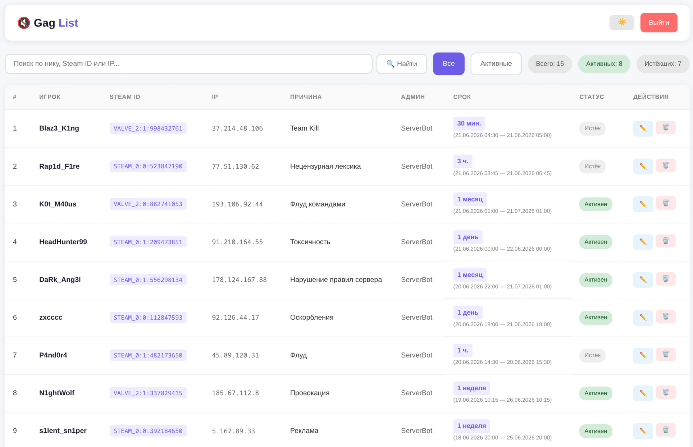
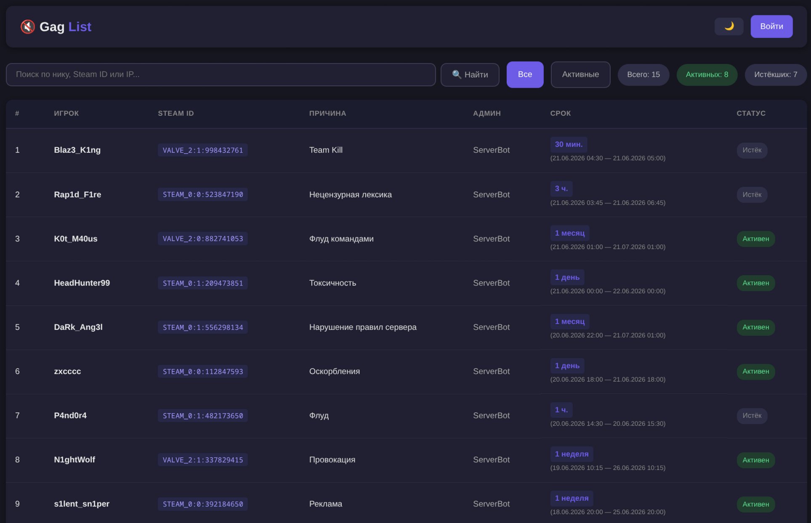
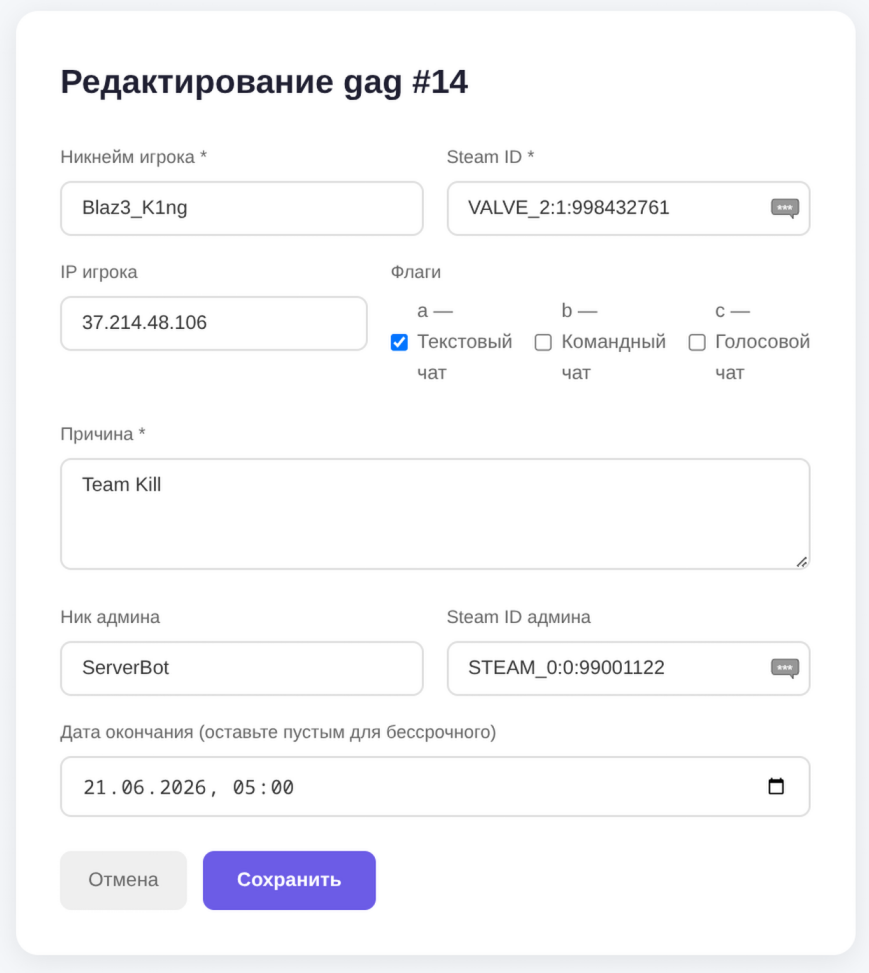
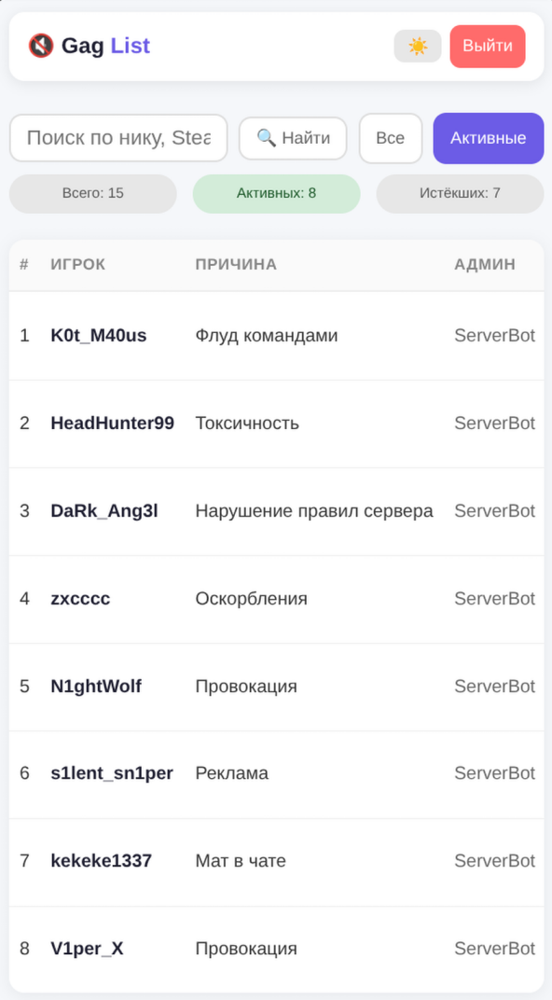
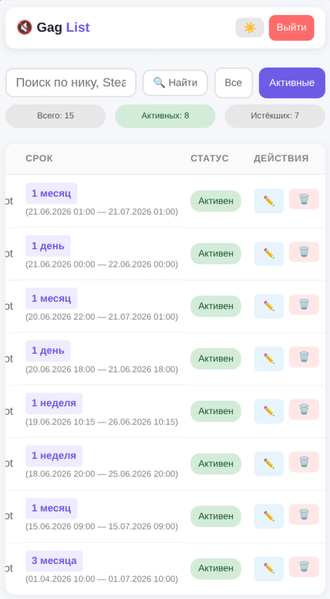

[English](README_EN.md)

# ChatAdditions Gag List

Веб-панель для просмотра и управления наказаниями типа **gag** (мут чата) из плагина [ChatAdditions_AMXX](https://github.com/ChatAdditions/ChatAdditions_AMXX) для серверов Counter-Strike 1.6.

## Возможности

- Просмотр всех gag-наказаний с сортировкой по дате (самые свежие сверху)
- Статус наказаний: **активен** / **истёк** / **навсегда**
- Срок наказания с человекочитаемым форматом (`7 дней (19.06.2026 09:54 — 26.06.2026 09:54)`)
- Фильтрация: все / только активные
- Поиск по нику, Steam ID или IP (включая кириллицу)
- Редактирование и удаление наказаний (требуется авторизация)
- Добавление новых gag-наказаний через веб-панель (требуется авторизация)
- Управление флагами gag (текстовый чат, командный чат, голосовой чат) через чекбоксы
- Тёмная и светлая тема с автосохранением выбора
- Адаптивный дизайн для мобильных устройств
- CSRF-защита на формах

## Скриншоты



<details>
<summary>Тёмная тема — рабочий стол</summary>



</details>

<details>
<summary>Форма редактирования</summary>



</details>

<details>
<summary>Мобильная версия</summary>




</details>

## Требования

- PHP 7.4+ с модулями `mysqli` и `mbstring`
- MySQL/MariaDB (тот же сервер, что используется плагином ChatAdditions)
- Nginx или другой веб-сервер с поддержкой PHP

## Установка

### 1. Клонируйте репозиторий

```bash
cd /var/www/html
git clone https://github.com/Nord1cWarr1or/ChatAdditions_Gaglist.git gaglist
```

### 2. Настройте подключение к БД

Отредактируйте `config.php`:

```php
define('DB_HOST', '127.0.0.1');
define('DB_USER', 'root');        // пользователь MySQL
define('DB_PASS', 'password');    // пароль MySQL
define('DB_NAME', 'db_name');     // имя БД из плагина (по умолчанию players_gags)

define('ADMIN_LOGIN', 'admin');   // логин для входа в панель
define('ADMIN_PASSWORD', 'changeme'); // пароль для входа в панель
define('GAGS_TABLE', 'chatadditions_gags'); // имя таблицы (не менять без необходимости)
```

### 3. Настройте Nginx

Добавьте в конфиг nginx (например, `/etc/nginx/sites-available/default`):

```nginx
location /gaglist/ {
    root /var/www/html;
    index index.php;
    try_files $uri $uri/ /gaglist/index.php?$args;

    location ~ \.php$ {
        fastcgi_pass unix:/var/run/php/php7.4-fpm.sock;
        fastcgi_index index.php;
        include fastcgi_params;
        fastcgi_param SCRIPT_FILENAME $document_root$fastcgi_script_name;
    }
}
```

### 4. Установите права доступа

```bash
sudo chown -R www-data:www-data /var/www/html/gaglist/
sudo chmod -R 755 /var/www/html/gaglist/
```

### 5. Перезагрузите nginx

```bash
sudo nginx -t
sudo systemctl reload nginx
```

### 6. Откройте панель

Перейдите по адресу `http://ваш-домен/gaglist/`

## Структура файлов

```
├── index.php      # Главная — список гагов (доступен без авторизации)
├── login.php      # Страница входа
├── logout.php     # Выход из панели
├── create.php     # Создание нового гага (требуется авторизация)
├── edit.php       # Редактирование гага (требуется авторизация)
├── delete.php     # Удаление гага (требуется авторизация, POST)
├── config.php     # Настройки БД, авторизация, вспомогательные функции
└── style.css      # Стили (светлая и тёмная тема)
```

## Структура БД

Панель работает с таблицей `chatadditions_gags` из плагина ChatAdditions:

| Поле | Тип | Описание |
|------|-----|----------|
| `id` | INTEGER PK | ID записи |
| `name` | VARCHAR(32) | Никнейм игрока |
| `authid` | VARCHAR(64) | Steam ID |
| `ip` | VARCHAR(22) | IP-адрес |
| `reason` | VARCHAR(256) | Причина наказания |
| `admin_name` | VARCHAR(32) | Никнейм админа |
| `admin_authid` | VARCHAR(64) | Steam ID админа |
| `admin_ip` | VARCHAR(22) | IP-адрес админа |
| `created_at` | DATETIME | Дата создания gag |
| `expire_at` | DATETIME | Дата окончания gag |
| `flags` | INTEGER | Битовая сумма флагов |

### Флаги

| Бит | Значение | Описание |
|-----|----------|----------|
| a | 1 | Текстовый чат |
| b | 2 | Текстовый командный чат |
| c | 4 | Голосовой чат |

Пример: `flags = 5` → запрещён текстовый чат (1) и голосовой чат (4).

## Технологии

- **Backend**: PHP 7.4+ (чистый PHP, без фреймворков)
- **БД**: MySQL/MariaDB (prepared statements)
- **Frontend**: HTML + CSS + Vanilla JavaScript

## Безопасность

- Prepared statements для защиты от SQL-инъекций
- `htmlspecialchars()` для защиты от XSS
- CSRF-токены на формах редактирования и удаления
- Авторизация через сессию

## Лицензия

[GPL-3.0](LICENSE.txt)

---

> Веб-панель создана с помощью ИИ-модели **MiMo-2.5** от Xiaomi.
