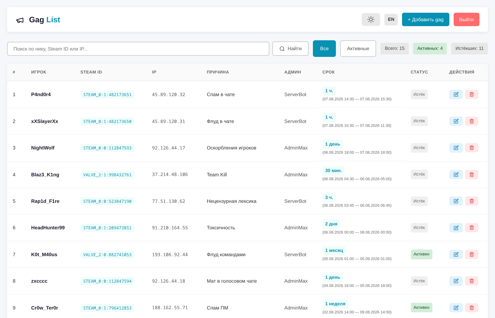
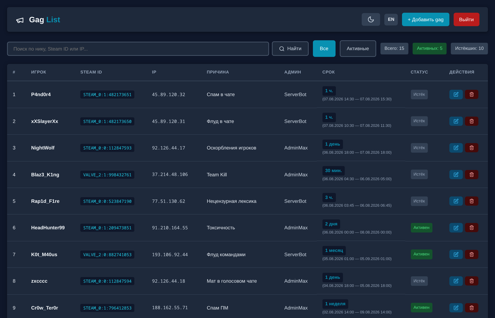
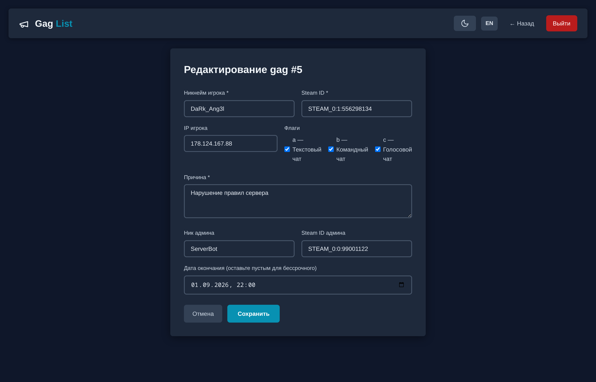
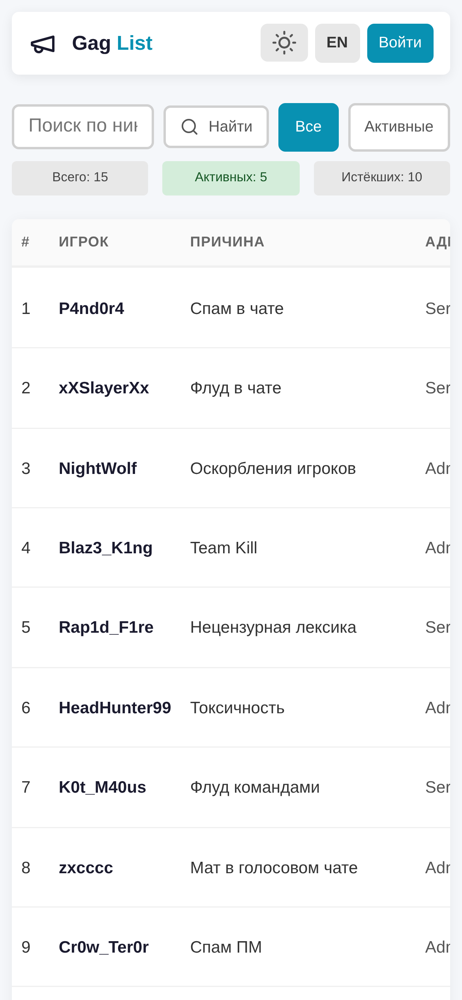
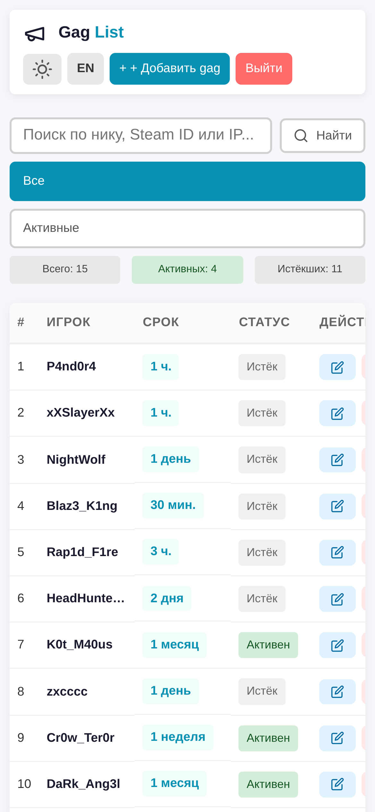

[Русский](README.md)

# ChatAdditions Gag List

Web panel for viewing and managing **gag** (chat mute) punishments from the [ChatAdditions_AMXX](https://github.com/ChatAdditions/ChatAdditions_AMXX) plugin for Counter-Strike 1.6 servers.

## Features

- View all gag punishments sorted by date (newest first)
- Punishment status: **active** / **expired** / **permanent**
- Human-readable duration format (`7 days (19.06.2026 09:54 — 26.06.2026 09:54)`)
- Filtering: all / active only
- Search by nickname, Steam ID, or IP (including Cyrillic)
- Edit and delete punishments (authentication required)
- Create new gag punishments from the web panel (authentication required)
- Gag flag management (text chat, team chat, voice chat) via checkboxes
- Dark and light theme with auto-save
- 10 color themes to choose from (Default, Forest, Sunset, Royal, Rose, Ocean, Crimson, Lavender, Amber, Mint)
- Responsive design for mobile devices
- CSRF protection on forms
- Multi-language localization (auto-detected from browser, dropdown in header)
- Easy to add a new language via Pull Request

## Screenshots



<details>
<summary>Dark theme — desktop</summary>



</details>

<details>
<summary>Edit form</summary>



</details>

<details>
<summary>Mobile view</summary>




</details>

## Requirements

- PHP 7.4+ with `mysqli` and `mbstring` extensions
- MySQL/MariaDB (same server used by the ChatAdditions plugin)
- Nginx or any other web server with PHP support

## Installation

### 1. Clone the repository

```bash
cd /var/www/html
git clone https://github.com/Nord1cWarr1or/ChatAdditions_Gaglist.git gaglist
```

### 2. Configure database connection

Edit `config.php`:

```php
define('DB_HOST', '127.0.0.1');
define('DB_USER', 'root');        // MySQL user
define('DB_PASS', 'password');    // MySQL password
define('DB_NAME', 'db_name');     // database name from the plugin (default: players_gags)

define('ADMIN_LOGIN', 'admin');   // panel login
define('ADMIN_PASSWORD', 'changeme'); // panel password
define('GAGS_TABLE', 'chatadditions_gags'); // table name (do not change unless necessary)
```

### 3. Configure Nginx

Add to your nginx config (e.g., `/etc/nginx/sites-available/default`):

```nginx
location /gaglist/ {
    root /var/www/html;
    index index.php;
    try_files $uri $uri/ /gaglist/index.php?$args;

    location ~ \.php$ {
        fastcgi_pass unix:/var/run/php/php7.4-fpm.sock;
        fastcgi_index index.php;
        include fastcgi_params;
        fastcgi_param SCRIPT_FILENAME $document_root$fastcgi_script_name;
    }
}
```

### 4. Set file permissions

```bash
sudo chown -R www-data:www-data /var/www/html/gaglist/
sudo chmod -R 755 /var/www/html/gaglist/
```

### 5. Reload nginx

```bash
sudo nginx -t
sudo systemctl reload nginx
```

### 6. Open the panel

Navigate to `http://your-domain/gaglist/`

## File Structure

```
├── index.php      # Main page — gag list (no auth required)
├── login.php      # Login page
├── logout.php     # Logout
├── create.php     # Create new gag (auth required)
├── edit.php       # Edit gag (auth required)
├── delete.php     # Delete gag (auth required, POST)
├── config.php     # DB settings, auth, helper functions
├── lang.php       # Loads localization from JSON, language detection
├── lang.json      # Translations (meta + keys for all languages)
├── theme.php      # Theme management (selection, switching, CSS loading)
├── footer.php     # Shared footer with theme switcher and dark/light toggle
├── style.css      # Styles (structure, components)
├── themes/        # Color themes
│   ├── default.css   # Default theme (cyan)
│   ├── forest.css    # Green
│   ├── sunset.css    # Amber
│   ├── royal.css     # Indigo
│   ├── rose.css      # Pink
│   ├── ocean.css     # Blue
│   ├── crimson.css   # Red
│   ├── lavender.css  # Purple
│   ├── amber.css     # Gold
│   └── mint.css      # Teal
```

## Database Structure

The panel uses the `chatadditions_gags` table from the ChatAdditions plugin:

| Column | Type | Description |
|--------|------|-------------|
| `id` | INTEGER PK | Record ID |
| `name` | VARCHAR(32) | Player nickname |
| `authid` | VARCHAR(64) | Steam ID |
| `ip` | VARCHAR(22) | IP address |
| `reason` | VARCHAR(256) | Punishment reason |
| `admin_name` | VARCHAR(32) | Admin nickname |
| `admin_authid` | VARCHAR(64) | Admin Steam ID |
| `admin_ip` | VARCHAR(22) | Admin IP address |
| `created_at` | DATETIME | Gag creation date |
| `expire_at` | DATETIME | Gag expiration date |
| `flags` | INTEGER | Bitwise flag sum |

### Flags

| Bit | Value | Description |
|-----|-------|-------------|
| a | 1 | Text chat |
| b | 2 | Team text chat |
| c | 4 | Voice chat |

Example: `flags = 5` → text chat (1) and voice chat (4) are disabled.

## Technologies

- **Backend**: PHP 7.4+ (vanilla PHP, no frameworks)
- **Database**: MySQL/MariaDB (prepared statements)
- **Frontend**: HTML + CSS + Vanilla JavaScript

## Localization

All translations are stored in `lang.json`. To add a new language:

1. Open `lang.json`
2. Add an entry in the `meta` block:
   ```json
   "de": { "name": "Deutsch", "flag": "🇩🇪" }
   ```
3. Add a translation block with the same keys:
   ```json
   "de": {
     "nav_title": "Gag <span>List</span>",
     "nav_add": "Add gag",
     ...
   }
   ```
4. Submit a Pull Request

If a key is missing for the current language, the Russian translation is used as fallback.

## Themes

The panel supports 10 color themes, each with light/dark variants. Theme choice is saved in `localStorage`.

### Available Themes

| Theme | Accent | Description |
|-------|--------|-------------|
| Default | `#0891b2` | Cyan (default) |
| Forest | `#15803d` | Green |
| Sunset | `#d97706` | Amber |
| Royal | `#6366f1` | Indigo |
| Rose | `#ec4899` | Pink |
| Ocean | `#2563eb` | Blue |
| Crimson | `#e11d48` | Red |
| Lavender | `#7c3aed` | Purple |
| Amber | `#b45309` | Gold |
| Mint | `#0891b2` | Teal |

### Adding a New Theme

1. Create a file `themes/yourtheme.css`
2. Define CSS variables for `:root` (light) and `body.dark` (dark):
   ```css
   :root {
       --accent: #your-accent;
       --bg: #your-bg;
       /* ... all variables ... */
   }
   body.dark {
       --accent: #your-dark-accent;
       --bg: #your-dark-bg;
       /* ... */
   }
   ```
3. Add the theme name to the `$names` array in the `theme_name()` function in `theme.php`
4. Submit a Pull Request

Use existing files in `themes/` as a reference for creating a new theme.

## Security

- Prepared statements to prevent SQL injection
- `htmlspecialchars()` to prevent XSS
- CSRF tokens on edit and delete forms
- Session-based authentication

## License

[GPL-3.0](LICENSE.txt)

---

> Web panel created with the help of **MiMo-2.5** AI model by Xiaomi.
